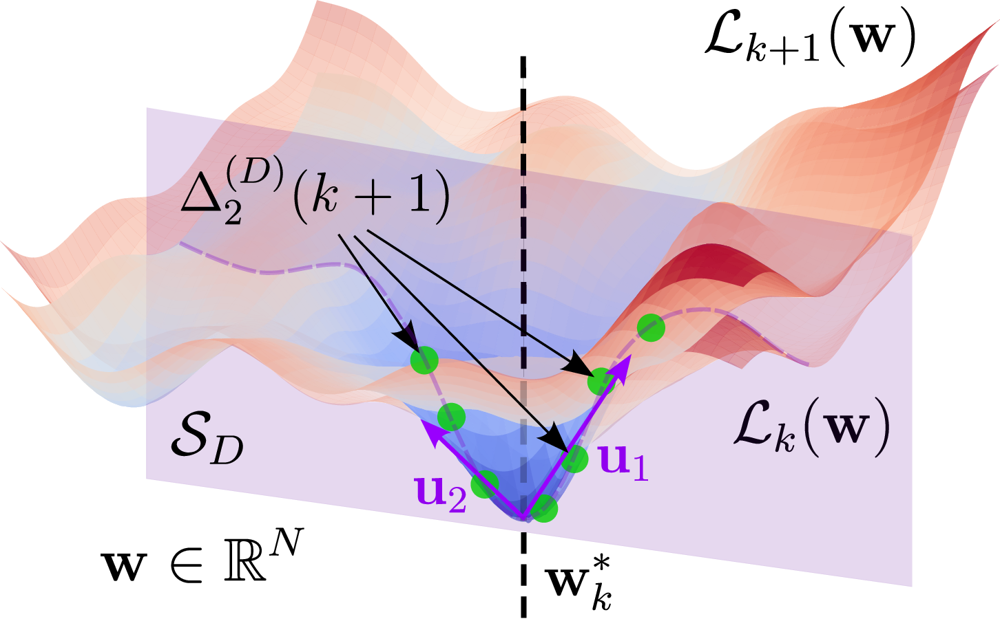

# Методы определения достаточного размера выборки в параметрических моделях

[](./paper/main.pdf) 
[](./slides/nir-12.pdf) 
[](./slides/pre-defense.pdf) 
[](./slides/main.pdf)

<div align="center">
    
</div>

<br>

**Автор:** Киселев Никита Сергеевич

**Научный руководитель:** Грабовой Андрей Валериевич, канд. физ.-мат. наук

## Аннотация

Работа посвящена количественному анализу стабилизации поверхности функции потерь параметрических моделей при увеличении объема обучающей выборки. Предложен унифицированный критерий стабилизации с функцией предпочтения точек в пространстве параметров и его частный случай, ограниченный на подпространство ведущих собственных векторов матрицы Гессе. Полученные теоретические оценки эмпирически проверены на полносвязной сети на MNIST и трансформерной языковой модели nanochat.

## Список работ автора по теме ВКР

### Публикации в рецензируемых научных журналах (ВАК, Web of Science, Scopus)

1. **Kiselev N.**, Meshkov V., Grabovoy A. Robust Convergence of Loss Landscapes through Distributional Averaging // *Proceedings of the ISP RAS*, 2025.
2. Meshkov V., **Kiselev N.**, Grabovoy A. ConvNets Landscape Convergence: Hessian-Based Analysis of Matricized Networks // *Ivannikov Ispras Open Conference (ISPRAS) – IEEE*, 2024.
3. **Kiselev N.**, Grabovoy A. Unraveling the Hessian: A Key to Smooth Convergence in Loss Function Landscapes // *Doklady Mathematics*, 2024.
4. **Kiselev N.**, Grabovoy A. Sample Size Determination: Posterior Distributions Proximity // *Computational Management Science*, 2025.
5. **Kiselev N.**, Grabovoy A. Sample Size Determination: Likelihood Bootstrapping // *Computational Mathematics and Mathematical Physics*, 2025.

### Выступления с докладом

1. Среднеквадратичный критерий сходимости ландшафта функции потерь на основе перехода к подпространству главных собственных векторов матрицы Гессе // *68-я Всероссийская научная конференция МФТИ*, 2026.
2. Устойчивая сходимость поверхности функции потерь через усреднение по распределению // *Открытая конференция ИСП РАН*, 2025.
3. Достаточный размер выборки и его связь со сходимостью поверхности функции потерь // *22-я Всероссийская конференция с международным участием "ММРО"*, 2025.
4. Сходимость поверхности функции потерь как признак достаточного размера выборки // *67-я Всероссийская научная конференция МФТИ*, 2025.
5. Определение достаточного размера выборки по апостериорному распределению параметров модели // *66-я Всероссийская научная конференция МФТИ*, 2024.

## Цитирование

```bibtex
@mastersthesis{kiselev_ms_thesis,
  author      = {Киселев, Никита Сергеевич},
  title       = {Методы определения достаточного размера выборки в параметрических моделях},
  type        = {Магистерская диссертация},
  institution = {Московский физико-технический институт (национальный исследовательский университет)},
  location    = {Москва},
  year        = {2026},
  langid      = {russian},
  url         = {https://github.com/intsystems/Kiselev-MS-Thesis}
}
